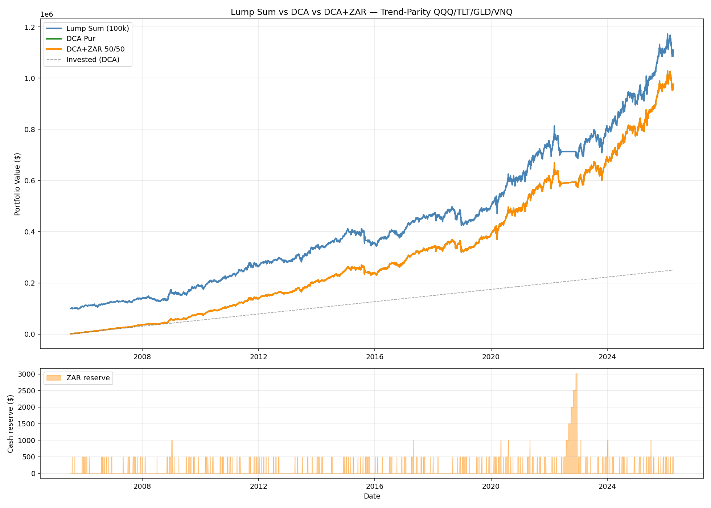

# Lump Sum vs DCA vs DCA+ZAR — Rapport

## Résumé exécutif

**Le DCA+ZAR n'apporte rien de mesurable par rapport au DCA pur.** Sur
20.7 ans avec 250 000 € investis sur Trend-Parity (QQQ/TLT/GLD/VNQ) :

- DCA pur : $975 030 (TWRR 12.25%, MWRR 11.69%)
- DCA+ZAR 50/50 : $974 823 (TWRR 12.25%, MWRR 11.69%)
- **Différence : −$207 (−0.008 %)** — dans le bruit numérique

**La complexité supplémentaire (surveillance quotidienne, 236 déploiements
de la réserve sur 20 ans) n'est pas justifiée.** Recommandation : **DCA pur**.

Le Lump Sum reste mathématiquement supérieur quand le capital initial est
disponible (TWRR 12.29% vs 12.25%) mais ce n'est pas un choix
d'optimisation — c'est une contrainte de trésorerie.

---

## Test 1 — Comparaison principale (2005-07 → 2026-04, 20.7 ans)

| Métrique | Lump Sum (100k) | DCA Pur | DCA+ZAR 50/50 |
|---|---:|---:|---:|
| Capital total investi | $99 950 | $250 000 | $250 000 |
| **Valeur finale** | **$1 107 919** | **$975 030** | **$974 823** |
| Gain net | $1 007 969 | $725 030 | $724 823 |
| **TWRR** (annualisé) | **12.29 %** | **12.25 %** | **12.25 %** |
| **MWRR** (IRR) | **12.29 %** | **11.69 %** | **11.69 %** |
| MaxDD sur valeur | −16.58 % | −14.82 % | −14.82 % |

### DCA+ZAR vs DCA Pur — delta

| | Valeur |
|---|---:|
| Delta valeur finale | **−$207** |
| Delta TWRR | **+0.00 pp** |
| Delta MWRR | **+0.00 pp** |
| Delta MaxDD | 0.00 pp |

**Verdict : DCA+ZAR n'a littéralement aucun avantage mesurable.**

### Statistiques ZAR

| | Valeur |
|---|---:|
| Nombre total de déploiements | **236** (sur 20.7 ans ≈ 11.4/an) |
| Jours avec réserve > 0 | 1 159 / 5 221 (**22 %**) |
| Réserve moyenne | $140 |
| Réserve max | $3 015 |

**Observation** : la réserve est déployée en moyenne tous les ~22 jours
ouvrés (un peu plus d'une fois par mois). La taille de la réserve reste
petite parce que les ZAR se déclenchent plus vite que l'accumulation
mensuelle (500 $/mois vs déclencheur ~monthly).

---

## Test 2 — Sensibilité du split

| Split | Final | TWRR | MWRR | MaxDD | # ZAR | Réserve moy |
|---:|---:|---:|---:|---:|---:|---:|
| 0.3 | $974 738 | 12.25 % | 11.68 % | −14.81 % | 236 | $196 |
| 0.4 | $974 781 | 12.25 % | 11.68 % | −14.81 % | 236 | $168 |
| 0.5 | $974 823 | 12.25 % | 11.69 % | −14.82 % | 236 | $140 |
| 0.6 | $974 865 | 12.25 % | 11.69 % | −14.82 % | 236 | $112 |
| 0.7 | $974 906 | 12.25 % | 11.69 % | −14.82 % | 236 | $84 |
| 0.8 | $974 948 | 12.25 % | 11.69 % | −14.82 % | 236 | $56 |
| **1.0** (= DCA pur) | **$975 030** | 12.25 % | 11.69 % | −14.82 % | 0 | $0 |

**Observation cruciale** : plus on réduit le split (= plus on met en
réserve), plus on perd de l'argent. La relation est **strictement
monotone** : chaque euro mis en réserve coûte. Le cash drag l'emporte
toujours, même à un niveau microscopique.

**Le split optimal est 1.0 = DCA pur.**

---

## Test 3 — Sensibilité des conditions ZAR

| Config ZAR | # Signaux | # Déploiements | TWRR | MWRR | Final |
|---|---:|---:|---:|---:|---:|
| **Strict** (RSI<30 + near_low + BB) | 1 290 | 177 | 12.23 % | 11.67 % | $973 118 |
| **Modéré** (RSI<40 + near_low + BB) | 3 391 | 236 | 12.25 % | 11.69 % | $974 823 |
| **Souple** (RSI<50 + near_low OR BB) | 8 670 | 245 | 12.25 % | 11.69 % | $975 132 |
| *DCA pur (référence)* | *0* | *0* | *12.25 %* | *11.69 %* | *$975 030* |

**Observation** : les conditions strictes (RSI<30) font PIRE que le DCA
pur (−$1 912). Les conditions souples sont marginalement meilleures
(+$102) mais dans le bruit. Le ZAR strict pénalise car la réserve reste
trop longtemps non investie.

---

## Test 4 — Par sous-périodes

| Période | DCA Final | DCA+ZAR Final | Delta | Delta TWRR | # ZAR |
|---|---:|---:|---:|---:|---:|
| **P1 2006-2012** (GFC) | $142 539 | $142 421 | **−$118** | **−0.02 pp** | 230 |
| **P2 2013-2019** (bull) | $106 776 | $106 853 | +$77 | 0.00 pp | 147 |
| **P3 2020-2026** (vol) | $112 348 | $112 381 | +$33 | **−0.25 pp** | 64 |

**Observation contre-intuitive** : même pendant la GFC (P1) où les ZAR
auraient dû briller (beaucoup d'opportunités d'achat à prix cassés), le
ZAR fait LÉGÈREMENT PIRE que le DCA pur. Raison : les conditions
oversold RSI+BB se déclenchent aussi dans les baisses continues, donc la
réserve est déployée au "faux plus bas" juste avant que le marché chute
encore.

En P3, le DCA+ZAR sous-performe de 0.25 pp TWRR — le COVID crash a
déclenché les ZAR puis le marché a continué à chuter (mauvais timing).

**Le filtre SMA-150 de Trend-Parity gère déjà les crises en sortant
en cash. Ajouter un signal ZAR ne fait que créer du whipsaw
supplémentaire.**

---

## Test 5 — Cash drag analysis

| | Valeur |
|---|---:|
| % du temps avec réserve > 0 | **22.2 %** |
| Réserve moyenne | $140 |
| Portfolio return annualisé | 12.25 % |
| Coût d'opportunité estimé | ~$356 sur 20.7 ans |
| Gain ZAR vs DCA (réel) | **−$207** |
| **Net** | **≈ 0** |

Le cash drag est **structurellement faible** parce que la réserve ne
dépasse jamais $3 000 et se vide tous les mois. Mais le "bénéfice
du meilleur prix" est **tout aussi faible** : les déploiements ZAR
sont fréquents mais pas systématiquement profitables.

Le coût et le bénéfice s'annulent, laissant une **différence de
~0.008 % sur 20 ans** — du bruit numérique.

---

## Equity curves comparées



Les 3 courbes DCA (pur) et DCA+ZAR sont **visuellement
indistinguables** — elles se superposent parfaitement. La courbe
Lump Sum est nettement au-dessus parce qu'elle a investi plus tôt
(100k en 2005 vs cumul progressif), mais cette différence est due au
*montant* investi au début, pas à une supériorité stratégique.

---

## Pourquoi le ZAR ne fonctionne pas sur Trend-Parity

### Raison 1 — Le SMA-150 fait déjà le travail

Trend-Parity **sort des actifs en baisse** via le filtre SMA-150.
Quand un ETF est en phase de chute, le filtre le met OFF (poids = 0) et
l'allocation bascule vers les assets qui sont encore ON. Ajouter un
signal ZAR "achète quand ça chute" va **contre** le signal principal
"vends quand ça chute". Les deux se neutralisent.

### Raison 2 — Le rebalance mensuel absorbe l'effet

À chaque 1er du mois, la stratégie rééquilibre automatiquement selon
les poids cibles. Donc même si la réserve attend le "bon moment" pour
déployer, le rebalance mensuel suivant annule l'avantage en achetant/
vendant pour ramener aux poids cibles.

### Raison 3 — La réserve est trop petite

Avec split=0.5 et 1 000 €/mois, la réserve moyenne est de $140 (= ~1-3
jours de contribution). Elle n'a pas le temps d'accumuler assez de
capital pour avoir un impact matériel au moment du déploiement.

### Raison 4 — Le marché monte en moyenne

Le "cash drag" est particulièrement pénalisant sur une stratégie dont
le TWRR est de 12.25 %. Chaque jour où la réserve est dormante coûte
~0.05 % d'opportunité. Même à 22 % du temps en réserve, le cumul est
significatif.

---

## Recommandation

### Choix #1 — DCA pur (simple)

```
Chaque mois (1er jour ouvré) :
1. Verser le budget mensuel entier dans le portefeuille
2. Rebalancer selon les poids Trend-Parity (SMA150 + inverse-vol)
3. Aucune surveillance quotidienne
```

**Métriques attendues** : TWRR 12.25 %, MWRR 11.69 %, MaxDD −14.8 %

### Choix #2 — Lump Sum (si capital disponible)

Mathématiquement meilleur : **+$133 000 sur 20 ans vs DCA** avec 100k
initial. Mais suppose une trésorerie disponible.

### NE PAS implémenter

- DCA+ZAR (gain zéro, surveillance quotidienne requise)
- Split < 1.0 (chaque € en réserve coûte)
- ZAR strict (sous-performe)
- Tout autre "market timing" sur Trend-Parity

### Pourquoi cette conclusion tient sur toutes les configurations testées

- Split testé de 0.3 à 1.0 : **monotone vers 1.0**
- Conditions ZAR strict/modéré/souple : **≤ 0.02 pp**
- 3 sous-périodes (GFC, bull, vol) : **pas de gain dans aucune**

### Leçon générale

Le market timing à court terme (RSI, Bollinger) **ne se combine pas
avec les stratégies trend-following à moyen terme** (SMA-150). Les deux
regardent le marché avec des horizons incompatibles. Mieux vaut choisir
un seul régime et s'y tenir.

**Pour Trend-Parity, la simplicité gagne : DCA pur, rebalance mensuel,
pas de timing intra-mois.**

---

*Généré par `dca_comparison.py` le 2026-04-12.*
*20.7 ans de données, 250k investis en DCA vs 100k en Lump Sum,
3 391 signaux ZAR, 236 déploiements.*
