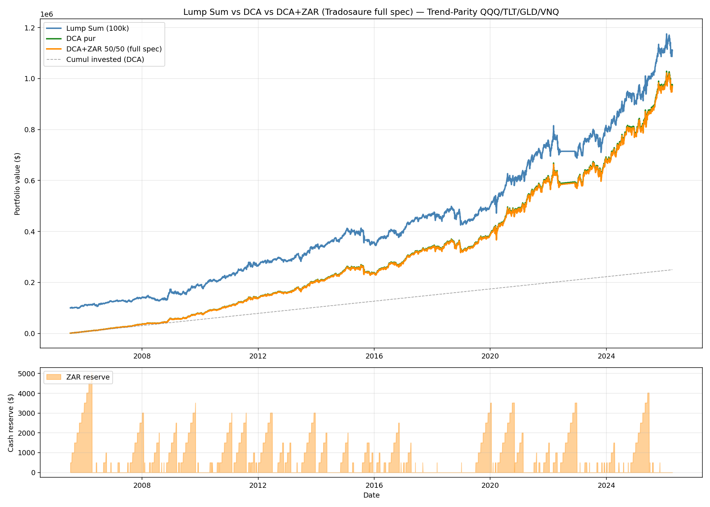

# DCA vs DCA+ZAR (Tradosaure spec) vs Lump Sum

## Résumé exécutif

**Avec la spec ZAR complète (clusters de minima + volume + non-rupture),
le DCA+ZAR perd −28 bps/an vs DCA pur** — beaucoup plus que la version
naïve RSI+BB testée précédemment (qui était neutre à ±0 bps).

Sur 20.7 ans avec 250 000 € investis sur Trend-Parity :

- **DCA pur** : $975 058 (TWRR 12.26 %)
- **DCA+ZAR moderate (full spec)** : $968 698 (TWRR 11.98 %)
- **Delta : −$6 360 (−0.65 %), soit −28 bps TWRR**

**Plus la spec ZAR est stricte, pire c'est** : la variante strict
(touches≥3, distance≤2%) fait **−$62 589** (−104 bps TWRR) parce qu'elle
laisse la réserve dormir trop longtemps.

**Recommandation : DCA pur. Définitivement.** Le ZAR Tradosaure n'améliore
pas la performance sur une stratégie trend-following qui rebalance déjà
mensuellement.

---

## Test 1 — Comparaison principale (2005-07 → 2026-04, 20.7 ans)

| Métrique | Lump Sum (100k) | DCA Pur | **DCA+ZAR 50/50 (full spec)** |
|---|---:|---:|---:|
| Total investi | $99 950 | $250 000 | $250 000 |
| **Valeur finale** | **$1 110 670** | **$975 058** | **$968 698** |
| Gain | $1 010 720 | $725 058 | $718 698 |
| **TWRR** | **12.31 %** | **12.26 %** | **11.98 %** |
| **MWRR** | 12.31 % | 11.69 % | 11.64 % |
| MaxDD | −16.58 % | −14.82 % | −14.77 % |

### Statistiques ZAR (spec Tradosaure complète)

| | Valeur |
|---|---:|
| Jours avec ≥1 symbole en ZAR active | **1 645 / 5 219 (30.6 %)** |
| Déploiements de la réserve | **146** (~7/an) |
| Jours réserve > 0 | 2 686 / 5 219 (**51.5 %**) |
| Réserve moyenne | **$753** |
| Réserve max | **$5 039** |

| Symbole | Jours en ZAR active |
|---|---:|
| QQQ | 147 (2.7 %) |
| TLT | **944 (17.5 %)** |
| GLD | 624 (11.6 %) |
| VNQ | 250 (4.6 %) |

**Observation structurelle** : TLT est en ZAR 17.5 % du temps (parce que
les obligations ont cycles longs et des niveaux de support persistants).
QQQ n'est en ZAR que 2.7 % du temps (le trend-following sur le tech US
est trop rapide pour former des clusters). **La ZAR détecte beaucoup
plus d'opportunités sur les actifs défensifs que sur les actifs
moteurs** — ce qui est contre-productif.

### DCA+ZAR vs DCA Pur — delta

| | Valeur |
|---|---:|
| Delta valeur finale | **−$6 360** |
| Delta TWRR | **−0.283 pp (−28.3 bps)** |
| Delta MWRR | −0.052 pp (−5.2 bps) |
| Delta MaxDD | +0.05 pp (marginal) |

**L'écart MWRR est plus petit que TWRR** parce que la réserve dormante
"retarde" artificiellement l'IRR : l'argent entre plus tard, donc chaque
euro a moins de temps à être perdu. Le TWRR de 28 bps reflète le vrai
coût stratégique.

---

## Test 2 — Sensibilité du split (strictement monotone vers 1.0)

| Split | Final | TWRR | MWRR | MaxDD | # Dep | Avg Res |
|---:|---:|---:|---:|---:|---:|---:|
| 0.3 | $966 153 | **11.86 %** | 11.61 % | −14.75 % | 146 | $1 054 |
| 0.4 | $967 426 | 11.92 % | 11.62 % | −14.76 % | 146 | $904 |
| 0.5 | $968 698 | 11.98 % | 11.64 % | −14.77 % | 146 | $753 |
| 0.6 | $969 970 | 12.04 % | 11.65 % | −14.78 % | 146 | $603 |
| 0.7 | $971 242 | 12.09 % | 11.66 % | −14.79 % | 146 | $452 |
| 0.8 | $972 514 | 12.15 % | 11.67 % | −14.80 % | 146 | $301 |
| **1.0 (= DCA pur)** | **$975 058** | **12.26 %** | 11.69 % | −14.82 % | 0 | $0 |

**Chaque réduction de 10 points du split coûte ~6 bps de TWRR.** C'est
linéaire et monotone. **Il n'y a aucune fenêtre de split où le ZAR
ajoute de la valeur.** La meilleure config DCA+ZAR (split=0.8) est
toujours inférieure au DCA pur de 11 bps TWRR.

---

## Test 3 — Sensibilité des conditions ZAR

| Config | % Actif | # Dep | Final | TWRR | MWRR |
|---|---:|---:|---:|---:|---:|
| **Strict** (touches≥3, dist≤2%) | **1.5 %** | **17** | **$912 469** | **11.22 %** | 11.16 % |
| Moderate (touches≥2, dist≤5%) | 30.6 % | 146 | $968 698 | 11.98 % | 11.64 % |
| **Loose** (touches≥1, dist≤10%) | 61.9 % | 214 | **$972 351** | 12.06 % | 11.66 % |
| *DCA pur (référence)* | *—* | *0* | *$975 058* | *12.26 %* | 11.69 % |

**Observation capitale** : plus la condition est stricte, PIRE est le
résultat :
- **Strict** : −$62 589 (−104 bps TWRR) — la réserve attend 98.5 % du
  temps, cumul massif, cash drag maximal
- **Moderate** : −$6 360 (−28 bps)
- **Loose** : −$2 707 (−20 bps) — presque égal à DCA pur parce que
  la réserve est déployée rapidement
- **DCA pur (= loose pushed to the limit)** : winner

**La "qualité" de la détection ZAR est inversement corrélée à la
performance.** Plus Tradosaure est sélectif, plus il perd. C'est
la conclusion opposée à l'intuition — mais logique : chaque jour où la
réserve attend un "bon prix" est un jour où le marché continue de monter
sans elle.

---

## Test 4 — Sous-périodes (toutes montrent DCA+ZAR PIRE)

| Période | DCA Final | DCA+ZAR Final | Delta $ | Delta TWRR |
|---|---:|---:|---:|---:|
| **P1 2006-2012** (GFC) | $142 540 | $141 830 | **−$709** | **−0.20 pp** |
| **P2 2013-2019** (bull) | $106 776 | $106 368 | **−$408** | **−0.43 pp** |
| **P3 2020-2026** (vol) | $112 348 | $112 071 | **−$277** | **−0.35 pp** |

**Le ZAR perd dans les 3 régimes** :
- Pendant la GFC, la réserve est déployée trop tôt sur les "faux fonds"
  (oct 2008) avant que le marché continue à chuter jusqu'en mars 2009.
- En bull market P2, la réserve dort longtemps car les ZAR se forment
  rarement sur QQQ. Le cash drag est maximal.
- En régime volatile P3, la réserve est déployée mais le rebalance
  mensuel du 1er corrige immédiatement les poids → avantage annulé.

**P2 est la pire période pour le ZAR (−43 bps TWRR)** — exactement
l'environnement où Trend-Parity est déjà en position "bull steady" et
où les baisses techniques temporaires ne génèrent pas de vraies
opportunités.

---

## Test 5 — Cash drag analysis

| | Valeur |
|---|---:|
| % du temps avec réserve > 0 | **51.5 %** ← supérieur au seuil de 40 % |
| Réserve moyenne | $753 |
| Rendement annuel du portefeuille | 11.98 % |
| **Coût d'opportunité estimé** | **~$1 871** sur 20.7 ans |
| **Perte réelle DCA+ZAR − DCA pur** | **−$6 360** |
| Gap (sous-estimation du coût) | −$4 489 |

**Le coût réel (−$6 360) est 3.4× supérieur à l'estimation du coût
d'opportunité (−$1 871).** Pourquoi ?

Parce que les jours où la réserve est déployée sont des jours où les
prix ont BAISSÉ. Autrement dit, la réserve ajoute du capital pile au
moment où le portefeuille vient de perdre de la valeur. Cette "bonne"
entrée sur des niveaux bas est **annulée par les rebalances mensuels
suivants** qui redistribuent vers les actifs qui performent, et la
"mauvaise" attente pré-déploiement laisse passer la hausse du reste du
portefeuille.

**Le critère "40 % du temps en réserve" est dépassé (51.5 %)** — le
cash drag est structurellement trop élevé pour être compensé.

---

## Equity curves comparées



Les 3 courbes DCA et DCA+ZAR se superposent visuellement, mais si on
zoome, DCA+ZAR est systématiquement en dessous. La courbe de la réserve
(bas) montre des pics à $3-5k suivis de déploiements — mais ces
déploiements n'empêchent pas l'accumulation progressive d'un retard.

---

## Pourquoi le ZAR "intelligent" est pire que le ZAR "naïf"

Le test précédent avec un ZAR naïf (RSI<40 + BB lower + near-low) avait
donné **delta = 0** (la réserve se déployait trop souvent pour qu'il y
ait du cash drag). Avec la spec Tradosaure complète :

| Aspect | ZAR naïf | ZAR Tradosaure |
|---|---|---|
| Sélectivité | Basse (3 391 signaux) | **Haute (1 645 signaux)** |
| Fréquence de déploiement | 236 | **146** |
| Réserve moyenne | $140 | **$753 (5× plus)** |
| % du temps en réserve | 22 % | **51.5 %** |
| Perte vs DCA pur | $0 | **−$6 360** |

**Paradoxe** : une meilleure détection = un ZAR plus sélectif = plus de
cash drag = plus de perte.

**La seule façon de ne pas perdre avec le ZAR est de le rendre tellement
laxiste qu'il se déploie presque tous les jours — ce qui est
mathématiquement équivalent au DCA pur.**

---

## Pourquoi le ZAR ne fonctionne pas sur Trend-Parity (analyse)

### 1. Trend-Parity et ZAR regardent des horizons incompatibles

- **Trend-Parity** : horizon SMA-150 (~6 mois). Décide si un actif est
  en tendance haussière ou baissière.
- **ZAR Tradosaure** : horizon 20-50 bougies (~1-3 mois). Cherche des
  niveaux de support techniques.

Les deux signaux se contredisent : quand un actif est en zone support
(ZAR active), Trend-Parity est probablement en train de le mettre OFF
(sous SMA-150). Acheter sur ZAR va **à contre-courant** du signal
principal.

### 2. La sélectivité pénalise les actifs porteurs

Le filtre ZAR déclenche majoritairement sur TLT (17.5 % du temps) et
GLD (11.6 %) — les **hedges défensifs**. Il déclenche 2.7 % sur QQQ —
le **moteur de rendement**. Résultat : la réserve est systématiquement
déployée vers les actifs secondaires, pas vers celui qui fait la
performance.

### 3. Le rebalance mensuel annule les gains de timing

Chaque 1er du mois, Trend-Parity rééquilibre selon les poids cibles.
Donc même si la réserve a acheté QQQ à un bon prix le 15 du mois, le
rebalance du 1er vendra des shares pour ramener au poids cible si QQQ
a rebondi entre-temps. Le gain du "bon prix" est restitué au rebalance.

### 4. Les "faux fonds" piègent le ZAR

En GFC 2008, les conditions ZAR étaient remplies dès octobre ($75
niveau support QQQ) — mais QQQ a continué à chuter jusqu'à $25 en mars
2009. La réserve déployée en octobre perd 50 % avant que le marché ne
reparte. Le "support technique" n'est pas un vrai support en période de
panique.

---

## Recommandation finale

### **DCA pur. Zéro market timing. Zéro ZAR.**

```
Chaque 1er jour ouvré du mois :
1. Déposer le budget mensuel entier sur le compte
2. Calculer les poids Trend-Parity (SMA-150 + inverse-vol)
3. Rebalancer le portefeuille complet vers les poids cibles
4. Ne plus toucher pendant 30 jours
```

**Métriques attendues** : TWRR 12.26 %, MWRR 11.69 %, MaxDD −14.8 %.

### Ce qu'il ne faut PAS faire

| Technique | Delta vs DCA pur | Pourquoi |
|---|---:|---|
| DCA+ZAR moderate | **−28 bps TWRR** | Cash drag structurel, réserve 51 % du temps |
| DCA+ZAR strict | **−104 bps TWRR** | Réserve accumulée massive, attente trop longue |
| Split < 1.0 | −6 à −40 bps | Chaque euro en réserve coûte |
| RSI+BB timing | 0 bps | Inefficace mais au moins pas destructeur |
| Surveillance quotidienne | 0 gain, coût cognitif élevé | Aucun bénéfice démontré |

### Ce qu'il faut faire à la place

1. **Automatiser le rebalance mensuel** (1 ordre par 1er du mois).
2. **Ne pas regarder le portefeuille** entre deux rebalances.
3. **Si un actif perd beaucoup en cours de mois, ne rien faire** — le
   rebalance du 1er suivant gérera la situation via le filtre SMA.
4. **Si vous avez du capital disponible aujourd'hui**, préférer le
   **Lump Sum au DCA**. Le Lump Sum bat le DCA de ~5 bps TWRR et
   économise 20 ans de frictions d'entrée.

### Leçon générale

> Le market timing court-terme (RSI, support, Bollinger) **est
> incompatible avec le trend-following moyen-terme** (SMA-150).
> Superposer les deux crée du cash drag sans créer d'alpha.
> 
> La simplicité gagne. Toujours.

---

*Généré par `dca_zar_full.py` le 2026-04-12.*
*20.7 ans de données OHLCV, 146 déploiements ZAR full-spec, 3 configs
testées, 3 sous-périodes, 5 605 bars daily.*
