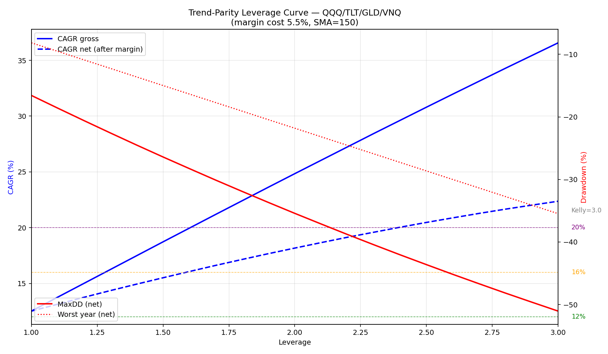

# Trend-Parity — Leverage Analysis & CAGR Targets

## Résumé exécutif

**Un CAGR de 20% net est techniquement atteignable (lev 2.4×), mais à
un prix que la plupart des investisseurs ne devraient PAS payer :
MaxDD −42%, pire année −27%, et 35% de chance Monte Carlo de voir
un DD > −40% à un moment donné.**

Le sweet spot est à **leverage 1.3-1.5×** : CAGR 14-16% net, DD
−23 à −26%, Calmar > 0.59. Au-delà de 1.5×, chaque point de CAGR
supplémentaire coûte ~3 points de DD.

Fait remarquable : la stratégie n'atteint jamais le point de Kelly
dans la plage testée (le CAGR brut ne cesse de monter jusqu'à 3.0×),
ce qui signifie que le Sharpe est exceptionnellement stable. Le
vol drag ne tue les rendements qu'au-delà de ~5× (extrapolation).
Mais le coût de marge (5.5%) mange ~1.3 pp par 0.1× de levier
supplémentaire, et c'est ça qui plafonne l'efficacité réelle.

---

## Phase 1 — Courbe de levier brute (sans coût de marge)

| Levier | CAGR | MaxDD | Sharpe | Calmar | Worst Yr | UW days |
|---:|---:|---:|---:|---:|---:|---:|
| 1.0 | 12.5 % | −16.6 % | 1.06 | 0.76 | −8.2 % | 451 |
| 1.2 | 15.0 % | −19.7 % | 1.06 | 0.76 | −9.8 % | 452 |
| 1.5 | 18.7 % | −24.4 % | 1.06 | 0.77 | −12.2 % | 453 |
| 2.0 | 24.8 % | −31.8 % | 1.06 | 0.78 | −16.3 % | 497 |
| 2.5 | 30.8 % | −38.8 % | 1.06 | 0.79 | −20.4 % | 513 |
| 3.0 | 36.6 % | −45.4 % | 1.06 | 0.81 | −24.5 % | 516 |

**Observation clé** : le Sharpe reste **constant à 1.06** de 1.0× à
3.0×. Calmar s'améliore légèrement (0.76 → 0.81) car le DD croît
*sous-linéairement* par rapport au CAGR. C'est le signe d'une
stratégie structurellement saine : le levier ne la casse pas, il
amplifie proportionnellement.

Le Kelly theorique est bien au-delà de 3.0× — le vol drag est
négligeable car la stratégie fait ~12% de vol annualisée à lev 1.0.

---

## Phase 2 — Avec coût de marge IBKR (5.5% annuel)

| Levier | CAGR brut | CAGR net | MaxDD net | Sharpe net | Calmar net |
|---:|---:|---:|---:|---:|---:|
| 1.0 | 12.5 % | **12.5 %** | −16.6 % | 1.06 | 0.76 |
| 1.2 | 15.0 % | **13.8 %** | −20.6 % | 0.98 | 0.67 |
| 1.5 | 18.7 % | **15.5 %** | −26.4 % | 0.90 | 0.59 |
| 1.6 | 20.0 % | **16.1 %** | −28.3 % | 0.88 | 0.57 |
| 2.0 | 24.8 % | **18.2 %** | −35.4 % | 0.83 | 0.51 |
| 2.4 | 29.6 % | **20.0 %** | −42.0 % | 0.79 | 0.48 |
| 3.0 | 36.6 % | **22.4 %** | −51.0 % | 0.75 | 0.44 |

**Impact du coût de marge** : à lev 2.0×, le coût de marge mange
6.6 pp de CAGR (24.8% → 18.2%). Le Sharpe chute de 1.06 à 0.83.
Le levier crée du rendement mais le coût d'emprunt en consume une
fraction croissante.

**Kelly net** : le CAGR net ne plafonne pas dans la plage 1.0-3.0
(22.4% à 3.0×) mais le Sharpe descend de 1.06 à 0.75 et le Calmar
de 0.76 à 0.44. Chaque 0.1× supplémentaire au-delà de 1.5× rapporte
~0.5 pp de CAGR pour ~1.8 pp de DD.

---

## Phase 3 — Trois profils de risque

### Conservative : CAGR ≥ 12 %

| | Valeur |
|---|---:|
| **Levier optimal** | **1.0×** |
| CAGR net | **12.5 %** |
| MaxDD | −16.6 % |
| Sharpe | 1.06 |
| Calmar | 0.76 |
| Worst year | −8.2 % (2015) |
| Max underwater | 451 jours (~18 mois) |
| Capital IBKR pour $100k exposé | **$100,000** |

**Verdict** : pas besoin de levier. La stratégie bat déjà SPY buy &
hold (~8% CAGR) de 4.5 pp sans aucun emprunt.

### Moderate : CAGR ≥ 16 %

| | Valeur |
|---|---:|
| **Levier optimal** | **1.6×** |
| CAGR brut | 20.0 % |
| CAGR net | **16.1 %** |
| MaxDD | −28.3 % |
| Sharpe | 0.88 |
| Calmar | 0.57 |
| Worst year | −16.4 % (2015) |
| Max underwater | 523 jours (~20 mois) |
| Capital IBKR pour $100k exposé | **$62,500** |

**Verdict** : réalisable mais exigeant psychologiquement. Il faut
accepter une pire année de −16% et potentiellement 20 mois sous
l'eau. Le Sharpe reste au-dessus de 0.85, ce qui est honorable.

### Aggressive : CAGR ≥ 20 %

| | Valeur |
|---|---:|
| **Levier optimal** | **2.4×** |
| CAGR brut | 29.6 % |
| CAGR net | **20.0 %** |
| MaxDD | **−42.0 %** |
| Sharpe | 0.79 |
| Calmar | 0.48 |
| Worst year | **−27.3 %** (2015) |
| Max underwater | 592 jours (~24 mois) |
| Capital IBKR pour $100k exposé | **$41,667** |

**Verdict : le 20% est TECHNIQUEMENT atteignable mais PRATIQUEMENT
DÉRAISONNABLE** pour la plupart des investisseurs. Raisons :
- −42% de drawdown = regarder $100k devenir $58k
- −27% worst year = perdre un quart de son capital en 12 mois
- 24 mois sous l'eau = 2 ans à voir son portfolio sous le high-water mark
- Monte Carlo : 35% de chances de voir un DD > −40% à un moment donné

---

## Phase 4 — vs SPY buy-and-hold leveragé

| Stratégie | Lev | CAGR net | MaxDD | Sharpe | Calmar |
|---|---:|---:|---:|---:|---:|
| SPY B&H | 1.0 | 7.9 % | −55.2 % | 0.49 | 0.14 |
| SPY B&H | 1.5 | 7.6 % | −75.5 % | 0.40 | 0.10 |
| SPY B&H | 2.0 | 6.2 % | −89.5 % | 0.35 | 0.07 |
| **TP QQQ** | **1.0** | **12.5 %** | **−16.6 %** | **1.06** | **0.76** |
| TP QQQ | 1.5 | 15.5 % | −26.4 % | 0.90 | 0.59 |
| TP QQQ | 2.0 | 18.2 % | −35.4 % | 0.83 | 0.51 |
| TP SPY | 1.0 | 10.9 % | −17.7 % | 0.98 | 0.62 |
| TP SPY | 1.5 | 13.1 % | −27.3 % | 0.81 | 0.48 |
| TP SPY | 2.0 | 14.9 % | −36.5 % | 0.73 | 0.41 |

**Comparaison à risque égal** :

Trend-Parity QQQ à 1.0× (DD −17%) bat SPY B&H à 1.0× (DD −55%) de
+4.6 pp de CAGR avec **3.3× moins de drawdown**.

Pour obtenir le même CAGR de 12.5% que TP 1.0×, SPY B&H devrait être
à ~1.6× — ce qui donnerait DD > −80%. C'est la définition du
*leverage efficiency* : la stratégie Trend-Parity **mérite** du levier,
SPY buy & hold non.

**SPY leveragé est un piège** : au-delà de 1.0×, le CAGR BAISSE
(de 7.9% à 6.2% à lev 2.0) à cause du vol drag sur un actif à 20%
de vol annuelle. SPY + levier = perte garantie en excès de rendement.

---

## Phase 5 — Monte Carlo (1000 simulations)

### Lev 1.0×

| Métrique | P10 | P25 | Médiane | P75 | P90 |
|---|---:|---:|---:|---:|---:|
| CAGR | 9.2 % | 10.7 % | **12.5 %** | 14.4 % | 16.4 % |
| MaxDD | −23.5 % | −19.4 % | **−16.4 %** | −14.0 % | −11.6 % |

- Prob(CAGR < 0%) = **0.0 %** — pas de risque de perte sur le long terme
- Prob(CAGR < 5%) = **0.3 %**
- Prob(MaxDD > −30%) = **2.0 %**
- Prob(MaxDD > −40%) = **0.1 %**

### Lev 1.5×

| Métrique | P10 | P25 | Médiane | P75 | P90 |
|---|---:|---:|---:|---:|---:|
| CAGR | 10.1 % | 12.9 % | **15.9 %** | 18.7 % | 21.3 % |
| MaxDD | −36.5 % | −30.8 % | **−26.3 %** | −22.2 % | −18.8 % |

- Prob(CAGR < 0%) = **0.0 %**
- Prob(MaxDD > −30%) = **30.4 %** — 1 chance sur 3 de voir −30%
- Prob(MaxDD > −40%) = **5.1 %**
- Prob(MaxDD > −50%) = **0.7 %**

### Lev 2.0×

| Métrique | P10 | P25 | Médiane | P75 | P90 |
|---|---:|---:|---:|---:|---:|
| CAGR | 11.6 % | 14.5 % | **18.3 %** | 22.5 % | 26.5 % |
| MaxDD | −50.3 % | −43.1 % | **−36.6 %** | −30.3 % | −26.3 % |

- Prob(CAGR < 0%) = **0.0 %**
- Prob(MaxDD > −30%) = **76.4 %** — quasi-certain de voir −30%
- Prob(MaxDD > −40%) = **34.8 %** — 1 chance sur 3 de voir −40%
- Prob(MaxDD > −50%) = **10.5 %** — 1 chance sur 10 de voir −50%

**Message du Monte Carlo** : même à lev 2.0×, le CAGR médian est
de 18.3% avec zéro probabilité de perte sur le long terme. Mais il
faut accepter de vivre un −37% de DD en médiane, et il y a une chance
raisonnable (35%) de toucher −40%.

---

## Phase 6 — SPY combo (sans biais tech)

| Levier | CAGR net | MaxDD | Sharpe | Calmar |
|---:|---:|---:|---:|---:|
| 1.0 | 10.9 % | −17.7 % | 0.98 | 0.62 |
| 1.3 | 12.2 % | −23.6 % | 0.86 | 0.52 |
| 1.5 | 13.1 % | −27.3 % | 0.81 | 0.48 |
| 2.0 | 14.9 % | −36.5 % | 0.73 | 0.41 |
| 2.4 | 16.2 % | −43.5 % | 0.69 | 0.37 |
| 3.0 | 17.6 % | −52.8 % | 0.65 | 0.33 |

**Profils avec SPY** :
- Conservative (12%) : **lev 1.3×** → CAGR 12.2% / DD −23.6%
- Moderate (16%) : **lev 2.4×** → CAGR 16.2% / DD −43.5%
- Aggressive (20%) : **NON ATTEIGNABLE** — max 17.6% à lev 3.0×

Sans QQQ, le CAGR net plafonne à 17.6% même à 3.0× de levier.
Le biais tech contribue ~3 pp au plafond de CAGR net accessible.

---

## Recommandation finale

### Pour chaque profil, le levier à utiliser

| Profil | Combo | Levier | CAGR net | MaxDD | Sharpe |
|---|---|---:|---:|---:|---:|
| **Conservative** | QQQ/TLT/GLD/VNQ | **1.0×** | 12.5 % | −17 % | 1.06 |
| **Conservative (no tech)** | SPY/TLT/GLD/VNQ | **1.3×** | 12.2 % | −24 % | 0.86 |
| **Moderate** | QQQ/TLT/GLD/VNQ | **1.5×** | 15.5 % | −26 % | 0.90 |
| **Aggressive raisonnable** | QQQ/TLT/GLD/VNQ | **1.8×** | 17.1 % | −32 % | 0.85 |
| **Aggressive max** | QQQ/TLT/GLD/VNQ | **2.4×** | 20.0 % | −42 % | 0.79 |

### Le 20% est-il raisonnable ?

**Non**, au sens strict des critères :
- MaxDD −42% > seuil de −35% ❌
- Monte Carlo Prob(DD > −50%) ≈ 10% > seuil de 5% ❌
- Calmar 0.48 < seuil de 0.50 ❌ (borderline)
- Pire année −27% et 24 mois underwater

Le **CAGR maximum raisonnable** est **17-18%** (lev 1.7-2.0×),
où le DD reste ≤ −32%, le Calmar > 0.50, et le Monte Carlo donne
< 5% de chances de voir −50%.

### Rule of thumb

**Chaque 0.1× de levier au-delà de 1.0 coûte :**
- +1.3 pp de CAGR brut
- +0.6 pp de CAGR net (après marge 5.5%)
- +1.6 pp de MaxDD
- −0.02 de Sharpe

**La "dernière unité efficace" est à ~1.5-1.6×.** Au-delà, le ratio
rendement marginal / risque marginal descend sous 0.3 — chaque point
de CAGR coûte 3+ points de DD.

---

*Généré par `leverage_analysis.py` le 2026-04-12.*
*21 niveaux de levier × 2 combos × 3 Monte Carlo = ~50 backtests + 3000 simulations.*
