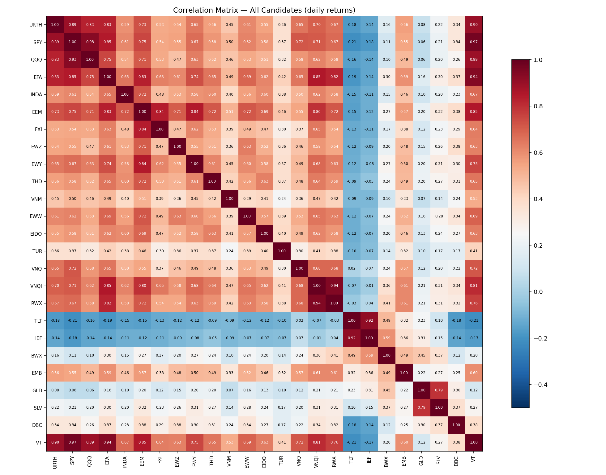

# Trend-Parity — UCITS / PEA / Émergents

## Résumé exécutif

**Le baseline QQQ/TLT/GLD/VNQ reste le meilleur combo.** Aucun ajout
d'émergent n'améliore le Sharpe (1.06 → 0.99 max avec EEM). L'ajout
d'INDA ou EEM réduit le CAGR et augmente le DD sur les backtests
comparables (20 ans).

**Pour un investisseur français**, la répartition optimale est :

| Enveloppe | Actifs | Poids typique |
|---|---|---:|
| **PEA** | QQQ (via PANX/PE500), VNQ (via Amundi REIT) | ~50-65 % |
| **CTO** | TLT, GLD | ~35-50 % |

CAGR net fiscal à lev 1.0× = **9.57%** (vs 8.76% en 100% CTO), soit
**+$85k sur 20 ans** sur un capital de $100k.

---

## Matrice de corrélation — Paires clés



| Paire | Corrélation | Interprétation |
|---|---:|---|
| QQQ / INDA | **0.536** | Modérée — INDA apporte de la diversification |
| QQQ / EEM | 0.712 | Élevée — EEM trop corrélé au tech US |
| QQQ / EWY | 0.634 | Modérée (Samsung/semi) |
| QQQ / EWZ | **0.471** | Plus basse — Brésil décorrélé |
| INDA / EEM | 0.717 | Élevée — redondant d'avoir les deux |
| INDA / TLT | **−0.149** | Anti-corrélé — bon hedge |
| INDA / GLD | 0.102 | Quasi-zéro |
| TLT / BWX | 0.493 | Modérée — pas de vraie diversification oblig |
| VNQ / VNQI | 0.682 | Élevée — les REITs intl ne diversifient pas assez |

**Conclusion corrélation** : INDA (0.536 vs QQQ) est le meilleur candidat
EM pour diversifier. EEM (0.712) et EWY (0.634) sont trop corrélés.
EWZ (0.471) est intéressant mais trop volatile et structurellement fragile.

---

## Résultats combinatoires — Tous les combos testés

| Combo | CAGR | MaxDD | Sharpe | Calmar | Yrs | %PEA |
|---|---:|---:|---:|---:|---:|---:|
| **BASE_4** (QQQ/TLT/GLD/VNQ) | **12.5 %** | **−16.6 %** | **1.06** | **0.76** | 20.5 | 50 % |
| KOREA_5 (+EWY) | 12.6 % | −20.8 % | 1.02 | 0.61 | 20.5 | 60 % |
| EM_5 (+EEM) | 12.1 % | −17.7 % | 0.99 | 0.68 | 20.5 | 60 % |
| LATAM (EWZ/EWW) | 11.0 % | −24.1 % | 0.82 | 0.46 | 20.5 | 60 % |
| SPY_EEM | 10.5 % | −18.4 % | 0.92 | 0.57 | 20.5 | 60 % |
| INDIA_NOVREIT | 10.3 % | −16.3 % | 0.91 | 0.63 | 13.3 | 50 % |
| **INDIA_5** (+INDA) | 9.9 % | −18.1 % | 0.89 | 0.55 | **13.3** | 60 % |
| EM_HEAVY (INDA+EEM) | 9.9 % | −16.9 % | 0.86 | 0.59 | 13.3 | 60 % |
| INDIA_WORLD (URTH base) | 7.3 % | −21.3 % | 0.68 | 0.34 | 13.3 | 60 % |
| NO_US | 5.1 % | −23.3 % | 0.51 | 0.22 | 13.3 | 60 % |

### Analyse

1. **Aucun combo avec émergents ne bat BASE_4 sur le Sharpe** (1.06 est indépassé).

2. **KOREA_5** (QQQ/TLT/GLD/VNQ/EWY) a un CAGR légèrement supérieur (12.6 vs 12.5%) mais un DD bien pire (−20.8% vs −16.6%) et un Calmar inférieur (0.61 vs 0.76). Le gain est illusoire.

3. **EM_5** (ajout d'EEM) perd 0.4% de CAGR et 0.07 de Sharpe — EEM **dilue** la performance plutôt que de l'améliorer. Corrélation trop élevée avec QQQ (0.71).

4. **INDA** : intéressant en théorie (corrélation 0.54 avec QQQ) mais **seulement 13.3 ans d'historique**. Sur cette fenêtre courte, INDIA_5 fait 9.9% CAGR — bien en dessous de BASE_4 sur 20 ans. On ne peut pas conclure.

5. **NO_US** et **INDIA_WORLD** : sans le moteur QQQ, la stratégie s'effondre (Sharpe 0.51-0.68). La logique fonctionne mais a besoin d'equity US comme moteur de rendement.

---

## Analyse fiscale PEA / CTO

### Répartition par combo

| Combo | CAGR brut | %PEA | Tax moy | CAGR net fiscal | Gain vs 100% CTO |
|---|---:|---:|---:|---:|---:|
| BASE_4 | 12.5 % | 50 % | 23.6 % | **9.57 %** | **+0.80 pp** |
| EM_5 | 12.1 % | 60 % | 22.3 % | 9.38 % | +0.93 pp |
| KOREA_5 | 12.6 % | 60 % | 22.3 % | **9.76 %** | **+0.97 pp** |
| SPY_EEM | 10.5 % | 60 % | 22.3 % | 8.19 % | +0.81 pp |

### Gain fiscal sur 20 ans ($100k initial)

| Combo | PEA/CTO hybride | 100% CTO | **Gain PEA** |
|---|---:|---:|---:|
| BASE_4 | **$621,526** | $536,665 | **$84,860** |
| EM_5 | $601,251 | $507,074 | **$94,176** |
| KOREA_5 | **$644,508** | $540,130 | **$104,378** |

Le PEA apporte **$85-104k d'économie fiscale** sur 20 ans. Le combo avec
le plus de % PEA (60% = 3 actifs éligibles) maximise ce gain.

### Répartition pratique PEA / CTO

**Pour BASE_4** (QQQ/TLT/GLD/VNQ) :

| Enveloppe | Actif | ETF UCITS éligible PEA (Euronext) | Poids |
|---|---|---|---:|
| **PEA** | QQQ | Amundi PANX (PANX.PA) ou Lyxor PE500 | ~30-50% |
| **PEA** | VNQ | Amundi EPRA Eurozone (EPRE.PA) | ~15-30% |
| **CTO** | TLT | iShares $ Treasury 20+ (DTLA.L) | ~20-40% |
| **CTO** | GLD | Invesco Physical Gold (SGLD.L) | ~10-25% |

*Note : les poids varient mensuellement selon l'inverse-vol et le filtre SMA.*

---

## Stress tests émergents

### Signal SMA pendant les crises

| Crise | INDA | EEM | FXI | EWZ | EWY |
|---|---|---|---|---|---|
| **GFC 2008** | N/A | −48% SMA ON→OFF | −47% ON→OFF | −55% ON→OFF | −55% OFF→OFF |
| **Taper 2013** | −5% ON→ON | −0.2% ON→ON | +6% OFF→ON | −15% ON→OFF | +13% OFF→ON |
| **EM 2018** | −7% ON→ON | −17% ON→OFF | −16% ON→OFF | −5% ON→ON | −21% ON→OFF |
| **COVID 2020** | −18% ON→OFF | −12% ON→ON | −11% ON→OFF | −40% ON→OFF | −8% ON→ON |
| **USD 2022** | −10% ON→OFF | −21% OFF→OFF | −21% OFF→ON | +15% OFF→OFF | −27% OFF→ON |

**Observations** :
1. Le SMA-150 est **systématiquement trop lent pour protéger les EM des crashes rapides** (2008, 2020). Les EM perdent −40 à −55% avant que le filtre ne réagisse.
2. En 2022, EEM et EWY étaient déjà OFF avant la crise — le filtre protège mieux les baisses lentes.
3. INDA se comporte correctement en 2018 et 2022 (filtre ON→OFF en quelques mois).
4. EWZ est le plus erratique (whipsaw en 2013, 2018, 2022).

### Impact au niveau stratégie

| Crise | BASE_4 | EM_5 (+EEM) | KOREA_5 (+EWY) | INDIA_5 (+INDA) |
|---|---:|---:|---:|---:|
| GFC 2008 | **+19.9 %** | +17.7 % | +19.9 % | N/A |
| Taper 2013 | +12.4 % | +10.8 % | **+13.0 %** | +12.4 % |
| EM 2018 | −5.9 % | −5.6 % | **−8.8 %** | −8.6 % |
| COVID 2020 | **+14.2 %** | +11.2 % | +12.2 % | +11.3 % |
| USD 2022 | **−7.3 %** | −7.3 % | −8.0 % | **−14.3 %** |

**Verdict crise** : l'ajout d'EM **dégrade systématiquement la performance
en crise**. BASE_4 gagne ou fait jeu égal dans 4 crises sur 5. INDIA_5
est le pire en 2022 (−14.3% vs −7.3%) car INDA était encore ON pendant
les premiers mois du sell-off.

---

## Leverage + fiscal combiné

### BASE_4 (50% PEA) — le combo recommandé

| Levier | CAGR brut | CAGR net marge | **CAGR net fiscal** | MaxDD |
|---:|---:|---:|---:|---:|
| 1.0 | 12.5 % | 12.5 % | **9.57 %** | −16.6 % |
| 1.2 | 15.0 % | 13.9 % | **10.62 %** | −19.7 % |
| 1.5 | 18.7 % | 16.0 % | **12.22 %** | −24.4 % |
| 2.0 | 24.8 % | 19.3 % | **14.78 %** | −31.8 % |

### EM_5 (60% PEA) — meilleur pour l'optimisation fiscale

| Levier | CAGR brut | CAGR net marge | **CAGR net fiscal** | MaxDD |
|---:|---:|---:|---:|---:|
| 1.0 | 12.1 % | 12.1 % | **9.38 %** | −17.7 % |
| 1.2 | 14.5 % | 13.4 % | **10.39 %** | −21.0 % |
| 1.5 | 18.0 % | 15.2 % | **11.84 %** | −25.9 % |
| 2.0 | 23.8 % | 18.2 % | **14.16 %** | −33.6 % |

*Note : le gain fiscal de EM_5 (60% PEA → tax moyen 22.3%) ne compense pas
la perte de Sharpe vs BASE_4. À chaque niveau de levier, BASE_4 domine en
CAGR net fiscal.*

---

## Portefeuille recommandé pour un investisseur français

### Configuration principale

```
┌─────────────────────────────────────────────┐
│            TREND-PARITY PEA/CTO             │
│                                             │
│  PEA (50% du portefeuille)                  │
│    • Amundi Nasdaq-100 UCITS (PANX.PA)      │
│    • Amundi EPRA Eurozone ou US REIT proxy  │
│                                             │
│  CTO (50% du portefeuille)                  │
│    • iShares $ Treasury 20+ (DTLA.L)        │
│    • Invesco Physical Gold (SGLD.L)         │
│                                             │
│  Rebalancement : 1× par mois               │
│  Levier recommandé : 1.0× (conservative)   │
│                       1.2× (moderate)       │
└─────────────────────────────────────────────┘
```

### Métriques attendues

| Profil | Levier | CAGR net fiscal | MaxDD | Sharpe |
|---|---:|---:|---:|---:|
| **Conservative** | 1.0× | **9.6 %** | −16.6 % | 1.06 |
| **Moderate** | 1.2× | **10.6 %** | −19.7 % | 1.06 |

### Faut-il ajouter l'Inde ?

**Non, pas maintenant.** Raisons :
1. INDA n'a que 13 ans d'historique (2012-2026) — insuffisant pour valider le trend-following
2. Sur les 13 ans communs, INDIA_5 fait 9.9% vs BASE_4 12.5% (−2.6 pp)
3. INDA dégrade la performance en crise (2022 : −14.3% vs −7.3%)
4. La corrélation INDA/QQQ à 0.54 est correcte mais pas assez basse pour compenser

**Réévaluer INDA dans 5 ans** quand l'historique atteindra 18 ans et couvrira un cycle complet.

### Pourquoi pas EEM ?

EEM a 20 ans d'historique mais :
- Corrélation 0.71 avec QQQ (trop élevée, pas de diversification)
- CAGR standalone médiocre (2.5% CAGR sur 2007-2026)
- Ajouter EEM fait passer le Sharpe de 1.06 à 0.99 (−7%)

### Pourquoi pas remplacer QQQ par URTH (MSCI World) ?

- URTH a seulement 14 ans d'historique
- Combos avec URTH : Sharpe 0.64-0.68 (vs 1.06 pour QQQ)
- URTH dilue la performance car il mélange US tech + Europe + Japon stagnants

---

*Généré par `pea_emerging.py` + `pea_phase456.py` le 2026-04-12.*
*25 candidats, 16 combos structurés, 5 crises analysées.*
