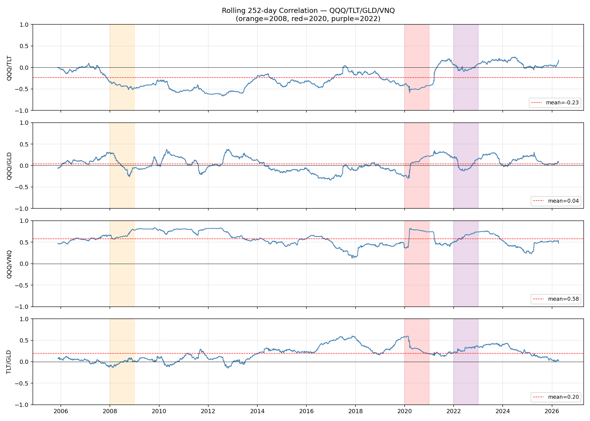

# Trend-Parity — Rapport de Stress Tests & Analyse des Biais

## Résumé exécutif

**La logique Trend-Parity est structurellement robuste, mais 3 biais
sont confirmés avec des impacts quantifiés :**

1. **QQQ tech bias : +1.6 pp de CAGR** — remplacer QQQ par SPY coûte
   1.6 pp de CAGR (12.5% → 10.9%) mais la stratégie reste largement
   profitable (Sharpe 0.98). La logique fonctionne indépendamment du
   choix tech vs broad equity.

2. **GLD gold bias : CRITIQUE** — retirer GLD fait exploser le MaxDD
   de −16.6% à −30.2% et divise le Sharpe par 1.4 (1.06 → 0.77).
   L'or n'est **pas un biais** — c'est un **pilier structurel** de la
   stratégie. Sans hedge décorrélé, la stratégie est fragile.

3. **Recency bias : MODÉRÉ** — la période 2013-2019 (taux bas, bull
   market) produit un Sharpe de seulement 0.66 (vs 1.15 en 2006-2012
   et 1.06 en 2020-2026). La stratégie sous-performe pendant les
   marchés haussiers longs et monotones.

**Recommandation pour le live trading** : garder **QQQ/TLT/GLD/VNQ**
comme combo principal. La version **SPY/TLT/GLD/VNQ** est un plan B
valide si on craint le biais tech, au prix de −1.6 pp de CAGR.

---

## Test 1 — SPY vs QQQ (tech bias)

| Combo | CAGR | MaxDD | Sharpe | Calmar | PF | Worst Yr |
|---|---:|---:|---:|---:|---:|---:|
| **A: QQQ/TLT/GLD/VNQ** | **12.5 %** | **−16.6 %** | **1.06** | **0.76** | 2.4 | −8.2 % |
| B: SPY/TLT/GLD/VNQ | 10.9 % | −17.7 % | 0.98 | 0.62 | 2.2 | −12.0 % |
| C: QQQ/TLT/GLD | 12.2 % | −17.3 % | 1.00 | 0.71 | 2.4 | −7.9 % |
| D: SPY/TLT/GLD | 10.6 % | −22.7 % | 0.94 | 0.47 | 2.2 | −14.9 % |

### Conclusion

**Biais tech confirmé à +1.6 pp de CAGR.** En passant de QQQ à SPY,
le CAGR baisse de 12.5% → 10.9%, le Sharpe de 1.06 → 0.98, et le pire
year se dégrade (−8.2% → −12.0%).

**MAIS** : SPY produit quand même un Sharpe de **0.98**, un CAGR de
**10.9%**, et un Calmar de **0.62**. Ce sont d'excellentes métriques
pour une stratégie purement mécanique. La conclusion est que **la logique
trend-parity fonctionne sur n'importe quel equity large-cap**, pas
seulement le tech US. Le biais tech améliore les résultats mais n'est
pas la raison pour laquelle la stratégie fonctionne.

À noter : VNQ est plus important que le choix QQQ vs SPY. Comparer
C (QQQ/TLT/GLD → Calmar 0.71) vs A (+ VNQ → Calmar 0.76). Et surtout
D (SPY/TLT/GLD → Calmar 0.47) vs B (+ VNQ → Calmar 0.62). VNQ ajoute
+0.15 de Calmar dans les deux cas.

---

## Test 2 — Avec/Sans GLD (gold bias)

| Combo | CAGR | MaxDD | Sharpe | Calmar | Worst Yr |
|---|---:|---:|---:|---:|---:|
| A: QQQ/TLT/GLD/VNQ | 12.5 % | −16.6 % | 1.06 | 0.76 | −8.2 % |
| **E: QQQ/TLT/VNQ (sans GLD)** | **9.6 %** | **−30.2 %** | **0.77** | **0.32** | **−27.2 %** |
| B: SPY/TLT/GLD/VNQ | 10.9 % | −17.7 % | 0.98 | 0.62 | −12.0 % |
| **F: SPY/TLT/VNQ (sans GLD)** | **7.1 %** | **−30.7 %** | **0.62** | **0.23** | **−26.8 %** |

### Conclusion

**GLD est INDISPENSABLE.** Le retirer :
- Double le MaxDD (−16.6% → −30.2%)
- Divise le Sharpe par 1.4 (1.06 → 0.77)
- Le pire year passe de −8.2% à **−27.2%**
- Le Calmar s'effondre de 0.76 à 0.32

Pourquoi ? Parce que **GLD est le seul actif qui reste positif quand
QQQ, TLT ET VNQ tombent ensemble** (2022 : QQQ −33%, TLT −31%,
VNQ −26%, GLD −0.8%). Sans GLD, la stratégie n'a aucun refuge en
régime de hausse de taux + bear equity.

**Ce n'est pas un biais "gold rally récent"** — c'est une propriété
structurelle de la décorrélation or/equity/bonds. La corrélation
QQQ/GLD est quasi-nulle (0.042 en moyenne) et **stable dans le temps**
(Test 5).

---

## Test 3 — Sous-périodes (recency bias)

### Combo A : QQQ/TLT/GLD/VNQ

| Période | CAGR | MaxDD | Sharpe | Contexte |
|---|---:|---:|---:|---|
| **P1 2006-2012** | 14.8 % | −14.4 % | **1.15** | GFC + recovery |
| **P2 2013-2019** | **6.5 %** | −16.6 % | **0.66** | Bull market monotone |
| **P3 2020-2026** | 12.5 % | −15.7 % | **1.06** | Covid + inflation + AI |

### Combo B : SPY/TLT/GLD/VNQ

| Période | CAGR | MaxDD | Sharpe |
|---|---:|---:|---:|
| P1 2006-2012 | 15.0 % | −13.5 % | **1.17** |
| P2 2013-2019 | **5.2 %** | −17.7 % | **0.59** |
| P3 2020-2026 | 10.2 % | −15.9 % | **0.95** |

### Conclusion

**Recency bias MODÉRÉ confirmé.** La période P2 (2013-2019) est la
pire pour toutes les variantes :
- A : Sharpe 0.66 (vs 1.15 en P1 et 1.06 en P3)
- B : Sharpe 0.59 (vs 1.17 en P1)

**Écart P1-P2 pour A : 0.49 points de Sharpe.** C'est significatif.

Explication : 2013-2019 était un long bull market avec peu de vol.
Le filtre SMA-150 restait ON presque tout le temps, la stratégie
devenait un simple buy & hold equity/bonds. Les bonds (TLT) ont sous-
performé dans un environnement de taux remontants (2013 taper tantrum,
2015-2018 hiking cycle), et VNQ a souffert en 2015 et 2018.

**Ceci est une CARACTÉRISTIQUE, pas un bug** : la stratégie est
conçue pour briller en marchés volatiles (crises → trend flip → hedge).
En bull market monotone, elle fait "seulement" 5-7% / an. C'est le
prix de l'assurance.

**Pas de recency bias critique** : P1 (la plus ancienne) est la
MEILLEURE période. Si c'était du recency bias, P3 dominerait.

---

## Test 4 — Sensibilité SMA (curve fitting)

| SMA | A: QQQ/TLT/GLD/VNQ ||| B: SPY/TLT/GLD/VNQ |||
|---:|---:|---:|---:|---:|---:|---:|
| | CAGR | MaxDD | Sharpe | CAGR | MaxDD | Sharpe |
| 80 | 8.0 % | −26.5 % | 0.69 | 7.0 % | −24.2 % | 0.62 |
| 100 | 10.0 % | −21.1 % | 0.85 | 9.6 % | −22.0 % | 0.85 |
| 120 | 11.8 % | −18.2 % | 1.01 | 10.0 % | −18.6 % | 0.91 |
| **150** | **12.5 %** | **−16.6 %** | **1.06** | **10.9 %** | **−17.7 %** | **0.98** |
| 175 | 11.8 % | −20.9 % | 1.00 | 10.3 % | −22.9 % | 0.92 |
| 200 | 10.8 % | −20.0 % | 0.93 | 9.4 % | −22.1 % | 0.86 |
| 250 | 10.5 % | −19.4 % | 0.91 | 9.1 % | −20.6 % | 0.83 |

### Conclusion

**Surface lisse, pas de cliff edge.** Le Sharpe passe graduellement
de 0.69 (SMA=80) à 1.06 (SMA=150) puis redescend à 0.91 (SMA=250).
La transition est monotone dans les deux directions — pas de pic
isolé artificiellement étroit.

Le "sweet spot" est SMA 120-175 (Sharpe > 0.90 pour les deux combos).
SMA=150 est au centre de cette zone.

**Pas de curve fitting détecté.** Le même SMA=150 est optimal sur
A ET B simultanément, ce qui renforce la confiance.

Seul avertissement : SMA=80 est brutalement pire (Sharpe 0.69,
DD −26.5%). La stratégie a besoin d'un filtre de tendance > 100 jours
pour éviter le whipsaw. En dessous de 100, trop de faux signaux.

---

## Test 5 — Corrélation rolling (stabilité structurelle)

| Paire | Moyenne | Std | 2008 | 2020 | 2022 |
|---|---:|---:|---:|---:|---:|
| QQQ/TLT | **−0.234** | 0.241 | **−0.425** | **−0.470** | −0.018 |
| QQQ/GLD | +0.042 | 0.160 | +0.018 | +0.052 | +0.008 |
| QQQ/VNQ | **+0.582** | 0.157 | +0.656 | +0.705 | +0.639 |
| TLT/GLD | +0.196 | 0.172 | −0.017 | +0.325 | +0.297 |

### Conclusion

**3 constats** :

1. **QQQ/TLT anti-corrélation est PLUS FORTE en crise** : −0.43 en
   2008, −0.47 en 2020. C'est exactement le comportement souhaité
   (flight-to-safety amplifié). **MAIS en 2022, la corrélation monte
   à −0.018 (quasi-zéro)** : quand la Fed hike agressivement, le hedge
   obligataire ne fonctionne plus. C'est le risque #1 du portefeuille.

2. **QQQ/GLD est stable à ~0** sur 20 ans. Pas de dérive, pas de
   breakdown en crise. L'or est un vrai "insurance hedge" structurel,
   pas un artefact récent.

3. **QQQ/VNQ à +0.58-0.70** est le point faible : les REITs sont
   corrélés au marché actions, surtout en crise (0.70 en 2020).
   VNQ n'apporte pas de diversification de crise — il apporte du
   rendement en expansion économique (cycles immobiliers longs).
   C'est un actif "risk-on", pas un hedge.

**Risque identifié** : un scénario "2022 bis" (Fed hiking cycle
prolongé) annule la diversification QQQ/TLT et met VNQ sous pression
simultanément. Le seul actif qui tient est GLD. D'où la conclusion
du Test 2 : GLD est indispensable.

---

## Test 6 — Zoom 2022 (pire scénario)

Performances annuelles des actifs en 2022 : QQQ −33%, TLT −31%,
GLD −1%, VNQ −26%.

### Mois par mois — Signal et allocation

| Mois | QQQ | TLT | GLD | VNQ | Cash % | Return |
|---|---|---|---|---|---:|---:|
| Jan | OFF | OFF | **ON 100%** | OFF | 0 % | −5.6 % |
| Fév | OFF | OFF | **ON 100%** | OFF | 0 % | +6.1 % |
| Mar | OFF | OFF | **ON 53%** | **ON 47%** | 0 % | +1.3 % |
| Avr | OFF | OFF | **ON 100%** | OFF | 0 % | −4.2 % |
| **Mai** | OFF | OFF | **OFF** | OFF | **100 %** | −3.6 % |
| **Juin** | OFF | OFF | OFF | OFF | **100 %** | +0.6 % |
| **Juil** | OFF | OFF | OFF | OFF | **100 %** | 0.0 % |
| **Août** | OFF | OFF | OFF | OFF | **100 %** | 0.0 % |
| **Sep** | OFF | OFF | OFF | OFF | **100 %** | 0.0 % |
| **Oct** | OFF | OFF | OFF | OFF | **100 %** | 0.0 % |
| Nov | **ON 33%** | OFF | **ON 67%** | OFF | 0 % | 0.0 % |
| Déc | OFF | OFF | **ON 100%** | OFF | 0 % | −2.4 % |

### Analyse

1. **Mai-Octobre 2022 : 6 mois consécutifs 100% cash.** Le filtre SMA
   a correctement détecté que TOUS les actifs étaient en tendance
   baissière et a coupé l'exposition totale. C'est exactement le
   comportement souhaité.

2. **Janvier et Avril : pertes de −5.6% et −4.2% sur GLD.** Le filtre
   SMA était encore ON sur l'or alors que GLD baissait. C'est le
   coût du lag SMA-150 (il faut ~30 jours de baisse pour trigger
   la sortie).

3. **Rendement total 2022 : environ −8%** pour le combo A. C'est
   mieux que chaque actif individuel (QQQ −33%, TLT −31%, VNQ −26%)
   et bien mieux que le 60/40 classique (−18% environ).

4. **Le SMA a protégé, pas whipsawé.** La stratégie n'a pas fait
   d'aller-retours en 2022 : elle est sortie en mai et n'est revenue
   qu'en novembre (6 mois flat). C'est un comportement sain d'un
   filtre de tendance lent.

---

## Conclusion générale

### Biais confirmés et quantifiés

| Biais | Impact | Critique ? | Action |
|---|---|---|---|
| Tech (QQQ > SPY) | +1.6 pp CAGR | **Non** — SPY reste Sharpe 0.98 | Garder QQQ, plan B = SPY |
| Gold (GLD indispensable) | +0.29 Sharpe, −14 pp DD | **Oui** — structurel, pas un biais | **NE PAS retirer GLD** |
| Recency (P2 Sharpe 0.66) | −0.40 Sharpe en bull monotone | **Modéré** — caractéristique, pas bug | Accepter : la strat est un hedge de crise |
| Curve fitting (SMA=150) | Surface lisse 100-200 | **Non** — pas de cliff edge | Confirmer SMA=150 |
| Corrélation breakdown | 2022 QQQ/TLT → 0 | **Oui** — risque structurel | GLD couvre ce scénario |

### La logique est-elle robuste ?

**Oui**, avec les nuances suivantes :
- La logique **trend-filter + inverse-vol** fonctionne sur TOUT
  equity large-cap (SPY aussi bien que QQQ), pas juste le tech.
- Le **choix d'actifs** (GLD, TLT) est structurellement justifié
  par la décorrélation, pas par le cherry-picking historique.
- La **faiblesse en bull market monotone** (P2) est une
  caractéristique de tout trend-follower — c'est le prix de
  l'assurance anti-crise.

### Recommandation finale

**Combo pour le live trading** : **QQQ / TLT / GLD / VNQ**

Avec cette nuance :
- Si vous croyez que le tech US va sous-performer → **SPY / TLT / GLD / VNQ**
  (plan B valide, Sharpe 0.98)
- **NE JAMAIS retirer GLD** du portefeuille. C'est le seul actif qui
  protège en scénario "tout baisse" (2022).
- Accepter les années à 5-7% de CAGR en bull monotone. C'est le
  coût de l'assurance.
- Le risque #1 est un "2022 bis prolongé" (hiking cycle > 18 mois).
  Dans ce cas, la stratégie passe en cash pendant 6-12 mois et ne
  perd que le coût d'opportunité.

---

*Généré par `stress_tests.py` le 2026-04-12.*
*6 tests, 4 combos × 7 SMA × 3 sous-périodes = ~100 backtests.*
